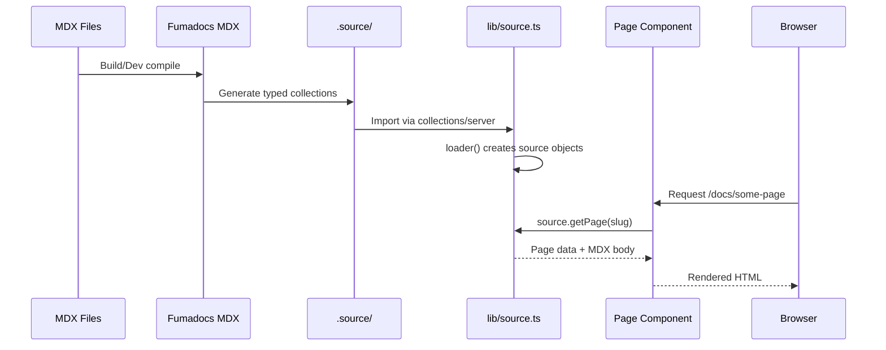
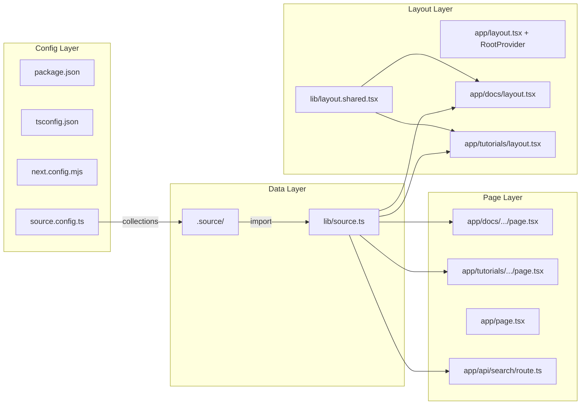

# Design Document: Fumadocs Init

## Overview

Dokumen ini mendeskripsikan desain teknis untuk inisialisasi situs dokumentasi dan tutorial Flutter menggunakan **Fumadocs** — framework dokumentasi berbasis Next.js App Router. Proyek ini membangun situs dari workspace yang hampir kosong menjadi platform dokumentasi lengkap dengan 4 collections (docs, news, packages, tutorials), fitur pencarian, dan konten tutorial Dart serta Flutter best practices.

### Tujuan Utama

1. Menyiapkan proyek Next.js dengan integrasi Fumadocs MDX, Fumadocs UI, dan Tailwind CSS v4
2. Mengkonfigurasi 4 collections MDX (docs, news, packages, tutorials) dengan source loader terpusat
3. Membangun routing dan layout untuk dokumentasi (`/docs`) dan tutorial (`/tutorials`)
4. Menyediakan konten awal tutorial Dart dan Flutter best practices
5. Mengaktifkan fitur pencarian dokumentasi menggunakan Orama (built-in Fumadocs)

### Keputusan Desain Utama

| Keputusan | Pilihan | Alasan |
|-----------|---------|--------|
| Content source | Fumadocs MDX | Sudah ada `.source/index.ts` yang mereferensikan `fumadocs-mdx/runtime` |
| Search engine | Orama (built-in) | Default dan gratis, tidak perlu layanan eksternal |
| Styling | Tailwind CSS v4 + Fumadocs preset | Standar Fumadocs UI, mendukung tema neutral |
| Layout pattern | Shared `baseOptions` + per-section `DocsLayout` | Memisahkan navigasi docs dan tutorials dengan sidebar masing-masing |
| Config format | `next.config.mjs` (ESM) | Fumadocs MDX bersifat ESM-only, memerlukan resolusi ESM yang akurat |

## Architecture

### Arsitektur Tingkat Tinggi

```mermaid
graph TB
    subgraph "Build Time"
        SC[source.config.ts] -->|defineDocs + defineConfig| FMDX[Fumadocs MDX Plugin]
        FMDX -->|generate| DOT_SOURCE[.source/]
        MDX_FILES[content/**/*.mdx] -->|input| FMDX
        NC[next.config.mjs] -->|createMDX| FMDX
    end

    subgraph "Runtime - Server"
        DOT_SOURCE -->|import collections| LIB_SOURCE[lib/source.ts]
        LIB_SOURCE -->|loader()| SOURCE_OBJ[source objects]
        SOURCE_OBJ -->|getPage, getPages, getPageTree| PAGES[Page Components]
        SOURCE_OBJ -->|createFromSource| SEARCH_API[API Search Route]
    end

    subgraph "Runtime - Client"
        ROOT_LAYOUT[app/layout.tsx + RootProvider] --> HOME[app/page.tsx]
        ROOT_LAYOUT --> DOCS_LAYOUT[app/docs/layout.tsx + DocsLayout]
        ROOT_LAYOUT --> TUTORIALS_LAYOUT[app/tutorials/layout.tsx + DocsLayout]
        DOCS_LAYOUT --> DOCS_PAGE[app/docs/...slug/page.tsx]
        TUTORIALS_LAYOUT --> TUTORIALS_PAGE[app/tutorials/...slug/page.tsx]
        ROOT_LAYOUT -->|Ctrl+K| SEARCH_DIALOG[Search Dialog]
        SEARCH_DIALOG -->|fetch| SEARCH_API
    end
```

### Alur Data



### Struktur Direktori

```
project-root/
├── .source/                    # Generated (Fumadocs MDX output)
│   └── index.ts
├── app/
│   ├── layout.tsx              # Root layout + RootProvider
│   ├── page.tsx                # Home page
│   ├── global.css              # Tailwind CSS v4 + Fumadocs styles
│   ├── api/
│   │   └── search/
│   │       └── route.ts        # Orama search API
│   ├── docs/
│   │   ├── layout.tsx          # DocsLayout dengan sidebar docs
│   │   └── [[...slug]]/
│   │       └── page.tsx        # Dynamic docs page renderer
│   └── tutorials/
│       ├── layout.tsx          # DocsLayout dengan sidebar tutorials
│       └── [[...slug]]/
│           └── page.tsx        # Dynamic tutorials page renderer
├── content/
│   ├── docs/
│   │   ├── index.mdx           # Docs landing page
│   │   └── meta.json           # Sidebar navigation order
│   ├── news/                   # Placeholder
│   ├── packages/               # Placeholder
│   └── tutorials/
│       ├── dart/
│       │   ├── index.mdx
│       │   ├── meta.json
│       │   ├── variables-dan-tipe-data.mdx
│       │   ├── fungsi.mdx
│       │   ├── control-flow.mdx
│       │   ├── class-dan-object.mdx
│       │   └── null-safety.mdx
│       ├── flutter-best-practices/
│       │   ├── index.mdx
│       │   ├── meta.json
│       │   ├── state-management.mdx
│       │   ├── project-structure.mdx
│       │   ├── widget-composition.mdx
│       │   ├── performance-optimization.mdx
│       │   └── error-handling.mdx
│       └── meta.json           # Top-level tutorials navigation
├── lib/
│   ├── source.ts               # Source loader (4 collections)
│   └── layout.shared.tsx       # Shared layout options (baseOptions)
├── mdx-components.tsx          # MDX component registry
├── source.config.ts            # Fumadocs MDX collections config
├── next.config.mjs             # Next.js + MDX plugin config
├── tsconfig.json               # TypeScript config + path aliases
├── package.json                # Dependencies
└── postcss.config.mjs          # PostCSS config for Tailwind v4
```

## Components and Interfaces

### 1. Project Initializer (`package.json`, `tsconfig.json`, `next.config.mjs`)

**Tanggung jawab:** Menyediakan fondasi proyek Next.js yang valid dengan semua dependensi dan konfigurasi build.

**`package.json`** — Dependensi utama:
```json
{
  "dependencies": {
    "next": "^15",
    "react": "^19",
    "react-dom": "^19",
    "fumadocs-core": "latest",
    "fumadocs-ui": "latest",
    "fumadocs-mdx": "latest"
  },
  "devDependencies": {
    "@types/mdx": "^2",
    "@types/react": "^19",
    "typescript": "^5",
    "tailwindcss": "^4",
    "@tailwindcss/postcss": "^4"
  }
}
```

**`next.config.mjs`** — Integrasi MDX plugin:
```typescript
import { createMDX } from 'fumadocs-mdx/next';

/** @type {import('next').NextConfig} */
const config = {
  reactStrictMode: true,
};

const withMDX = createMDX();
export default withMDX(config);
```

**`tsconfig.json`** — Path alias untuk collections:
```json
{
  "compilerOptions": {
    "paths": {
      "@/*": ["./*"],
      "collections/*": ["./.source/*"]
    }
  }
}
```

### 2. MDX Configurator (`source.config.ts`)

**Tanggung jawab:** Mendefinisikan 4 collections MDX dan konfigurasi global.

```typescript
import { defineDocs, defineConfig } from 'fumadocs-mdx/config';

export const docs = defineDocs({ dir: 'content/docs' });
export const news = defineDocs({ dir: 'content/news' });
export const packages = defineDocs({ dir: 'content/packages' });
export const tutorials = defineDocs({ dir: 'content/tutorials' });

export default defineConfig();
```

**Interface:** Setiap collection menghasilkan typed output di `.source/` yang dapat diimpor via `collections/server`.

### 3. Source Loader (`lib/source.ts`)

**Tanggung jawab:** Memuat data dari collections dan menyediakan API untuk mengakses halaman.

```typescript
import { docs, news, packages, tutorials } from 'collections/server';
import { loader } from 'fumadocs-core/source';

export const source = loader({
  baseUrl: '/docs',
  source: docs.toFumadocsSource(),
});

export const newsSource = loader({
  baseUrl: '/news',
  source: news.toFumadocsSource(),
});

export const packagesSource = loader({
  baseUrl: '/packages',
  source: packages.toFumadocsSource(),
});

export const tutorialsSource = loader({
  baseUrl: '/tutorials',
  source: tutorials.toFumadocsSource(),
});
```

**API yang disediakan per source object:**
- `getPage(slugs: string[]): Page | undefined` — Mengambil halaman berdasarkan slug
- `getPages(): Page[]` — Mengambil semua halaman
- `getPageTree(): PageTree` — Mengambil tree navigasi untuk sidebar
- `generateParams(): { slug: string[] }[]` — Untuk `generateStaticParams`

### 4. UI Provider & Root Layout (`app/layout.tsx`)

**Tanggung jawab:** Membungkus aplikasi dengan `RootProvider` untuk menyediakan konteks tema, pencarian, dan navigasi.

```typescript
import { RootProvider } from 'fumadocs-ui/provider/next';
import type { ReactNode } from 'react';
import './global.css';

export default function RootLayout({ children }: { children: ReactNode }) {
  return (
    <html lang="id" suppressHydrationWarning>
      <body className="flex flex-col min-h-screen">
        <RootProvider>{children}</RootProvider>
      </body>
    </html>
  );
}
```

### 5. Shared Layout Options (`lib/layout.shared.tsx`)

**Tanggung jawab:** Menyediakan konfigurasi navigasi bersama untuk semua layout.

```typescript
import type { BaseLayoutProps } from 'fumadocs-ui/layouts/shared';

export function baseOptions(): BaseLayoutProps {
  return {
    nav: {
      title: 'Flutter Docs',
    },
    links: [
      { text: 'Dokumentasi', url: '/docs' },
      { text: 'Tutorial', url: '/tutorials' },
    ],
  };
}
```

### 6. Docs Layout (`app/docs/layout.tsx`)

**Tanggung jawab:** Layout khusus halaman dokumentasi dengan sidebar.

```typescript
import { DocsLayout } from 'fumadocs-ui/layouts/docs';
import type { ReactNode } from 'react';
import { source } from '@/lib/source';
import { baseOptions } from '@/lib/layout.shared';

export default function Layout({ children }: { children: ReactNode }) {
  return (
    <DocsLayout tree={source.getPageTree()} {...baseOptions()}>
      {children}
    </DocsLayout>
  );
}
```

### 7. Tutorials Layout (`app/tutorials/layout.tsx`)

**Tanggung jawab:** Layout khusus halaman tutorial dengan sidebar terpisah.

Menggunakan pola yang sama dengan Docs Layout tetapi menggunakan `tutorialsSource.getPageTree()` untuk sidebar navigasi tutorial.

### 8. Page Renderer (`app/docs/[[...slug]]/page.tsx` dan `app/tutorials/[[...slug]]/page.tsx`)

**Tanggung jawab:** Merender halaman MDX secara dinamis berdasarkan slug URL.

**Alur rendering:**
1. Terima `params.slug` dari Next.js dynamic route
2. Panggil `source.getPage(slug)` untuk mendapatkan data halaman
3. Jika halaman tidak ditemukan, panggil `notFound()`
4. Render `<DocsPage>` dengan `<DocsBody>` yang berisi komponen MDX
5. Sertakan `<DocsPage.Toc>` untuk table of contents

**Exports:**
- `generateStaticParams()` — Menghasilkan semua slug untuk static generation
- `generateMetadata()` — Menghasilkan metadata SEO dari frontmatter

### 9. MDX Component Registry (`mdx-components.tsx`)

**Tanggung jawab:** Mendaftarkan komponen default Fumadocs UI untuk rendering MDX.

```typescript
import { defaultMdxComponents } from 'fumadocs-ui/mdx';
import type { MDXComponents } from 'mdx/types';

export function getMDXComponents(components?: MDXComponents): MDXComponents {
  return {
    ...defaultMdxComponents,
    ...components,
  };
}

export function useMDXComponents(components: MDXComponents): MDXComponents {
  return getMDXComponents(components);
}
```

### 10. Search API (`app/api/search/route.ts`)

**Tanggung jawab:** Menyediakan endpoint pencarian menggunakan Orama.

```typescript
import { source } from '@/lib/source';
import { tutorialsSource } from '@/lib/source';
import { createSearchAPI } from 'fumadocs-core/search/server';

export const { GET } = createSearchAPI('advanced', {
  indexes: [
    ...source.getPages().map((page) => ({
      title: page.data.title,
      description: page.data.description,
      url: page.url,
      id: page.url,
      structuredData: page.data.structuredData,
    })),
    ...tutorialsSource.getPages().map((page) => ({
      title: page.data.title,
      description: page.data.description,
      url: page.url,
      id: page.url,
      structuredData: page.data.structuredData,
    })),
  ],
});
```

### 11. Style System (`app/global.css`)

**Tanggung jawab:** Mengkonfigurasi Tailwind CSS v4 dengan preset Fumadocs.

```css
@import 'tailwindcss';
@import 'fumadocs-ui/css/neutral.css';
@import 'fumadocs-ui/css/preset.css';

@source '../node_modules/fumadocs-ui/dist/**/*.js';
```

### Diagram Interaksi Komponen



## Data Models

### MDX Frontmatter Schema

Setiap file MDX menggunakan frontmatter standar Fumadocs:

```typescript
interface PageFrontmatter {
  title: string;        // Judul halaman (wajib)
  description?: string; // Deskripsi untuk SEO dan preview
  icon?: string;        // Icon untuk sidebar navigation
  full?: boolean;       // Full-width layout (tanpa TOC)
}
```

### Collection Output Types

Fumadocs MDX menghasilkan typed output untuk setiap collection:

```typescript
// Generated di .source/ — diakses via 'collections/server'
interface CollectionOutput {
  toFumadocsSource(): FumadocsSource;
}

// Dari loader() di fumadocs-core/source
interface SourceObject {
  getPage(slugs: string[]): Page | undefined;
  getPages(): Page[];
  getPageTree(): PageTree;
  generateParams(): { slug: string[] }[];
}

interface Page {
  url: string;
  slugs: string[];
  data: {
    title: string;
    description?: string;
    structuredData: StructuredData;
    body: MDXContent;       // Komponen React untuk rendering
    toc: TableOfContents[]; // Table of contents items
  };
}
```

### Navigation Structure (`meta.json`)

File `meta.json` mengontrol urutan dan struktur sidebar:

```typescript
// content/docs/meta.json
interface MetaJson {
  title?: string;       // Override folder title
  pages: string[];      // Urutan halaman (nama file tanpa ekstensi)
  defaultOpen?: boolean; // Apakah folder terbuka secara default
}
```

### Content Directory Structure

```
content/
├── docs/
│   ├── meta.json              # ["index", ...]
│   └── index.mdx              # title: "Dokumentasi"
├── news/                      # Placeholder (kosong)
├── packages/                  # Placeholder (kosong)
└── tutorials/
    ├── meta.json              # ["---Dart---", "dart", "---Flutter---", "flutter-best-practices"]
    ├── dart/
    │   ├── meta.json          # ["index", "variables-dan-tipe-data", "fungsi", ...]
    │   ├── index.mdx          # Pengantar Dart
    │   ├── variables-dan-tipe-data.mdx
    │   ├── fungsi.mdx
    │   ├── control-flow.mdx
    │   ├── class-dan-object.mdx
    │   └── null-safety.mdx
    └── flutter-best-practices/
        ├── meta.json          # ["index", "state-management", "project-structure", ...]
        ├── index.mdx          # Pengantar Flutter Best Practices
        ├── state-management.mdx
        ├── project-structure.mdx
        ├── widget-composition.mdx
        ├── performance-optimization.mdx
        └── error-handling.mdx
```

## Correctness Properties

> **PBT Tidak Applicable untuk Fitur Ini**
>
> Property-based testing (PBT) **tidak diterapkan** pada fitur ini karena seluruh acceptance criteria termasuk dalam kategori yang tidak cocok untuk PBT:
>
> - **Scaffolding & Konfigurasi:** Mayoritas kriteria (35+) adalah pengecekan keberadaan file dan isi konfigurasi statis (SMOKE tests). Tidak ada variasi input yang bermakna — file konfigurasi bersifat deterministik.
> - **UI Rendering:** Kriteria terkait tampilan sidebar, styling, dan layout adalah visual tests yang tidak dapat diuji dengan universal properties.
> - **Library Behavior:** Kriteria seperti `source.getPage(slug)` dan pencarian menguji behavior library Fumadocs (kode eksternal), bukan logika kita sendiri.
> - **Integration:** Kriteria build success dan rendering halaman memerlukan environment Next.js penuh.
>
> Tidak ada pure function, algoritma, atau business logic dengan input space yang bervariasi. Pola "for all inputs X, property P(X) holds" tidak berlaku di sini. Testing strategy menggunakan smoke tests, example-based tests, dan integration tests sebagai gantinya.

## Error Handling

### Build-Time Errors

| Error | Penyebab | Penanganan |
|-------|----------|------------|
| `Module not found: fumadocs-mdx` | Dependensi belum terinstall | Pastikan `npm install` dijalankan sebelum `next dev` |
| `Cannot find module 'collections/server'` | Path alias belum dikonfigurasi atau `.source/` belum di-generate | Pastikan `tsconfig.json` memiliki path alias `collections/*` dan jalankan `next dev` untuk generate `.source/` |
| `source.config.ts` parse error | Sintaks TypeScript tidak valid di konfigurasi | Validasi file `source.config.ts` menggunakan TypeScript compiler |
| MDX compilation error | Frontmatter tidak valid atau sintaks MDX salah | Periksa frontmatter YAML dan pastikan semua komponen MDX terdaftar |

### Runtime Errors

| Error | Penyebab | Penanganan |
|-------|----------|------------|
| 404 Not Found | Slug URL tidak cocok dengan halaman manapun | Page renderer memanggil `notFound()` dari Next.js — menampilkan halaman 404 default |
| Hydration mismatch | Tema dark/light menyebabkan perbedaan server/client | `suppressHydrationWarning` pada `<html>` mencegah warning ini |
| Search API error | Konten belum terindeks atau API route tidak tersedia | `createSearchAPI` / `createFromSource` menangani error secara internal; Fumadocs UI menampilkan pesan "tidak ada hasil" |
| Missing frontmatter | File MDX tanpa `title` di frontmatter | Fumadocs MDX akan memberikan warning saat build; pastikan setiap file MDX memiliki minimal `title` |

### Strategi Error Handling

1. **Fail-fast pada build time:** Kesalahan konfigurasi (missing dependencies, invalid config) akan menyebabkan build gagal dengan pesan error yang jelas dari Next.js atau Fumadocs MDX.
2. **Graceful degradation pada runtime:** Halaman yang tidak ditemukan menghasilkan 404, bukan crash. Search yang gagal menampilkan "tidak ada hasil".
3. **Type safety:** TypeScript dan Fumadocs MDX typed collections memastikan kesalahan tipe terdeteksi saat development.

## Testing Strategy

### Pendekatan Testing

Karena fitur ini adalah **project scaffolding dan konfigurasi** (bukan business logic), strategi testing berfokus pada:

1. **Smoke Tests** — Memverifikasi keberadaan dan isi file konfigurasi
2. **Example-Based Tests** — Memverifikasi behavior spesifik (404 handling, code block presence)
3. **Integration Tests** — Memverifikasi build success dan rendering halaman

### Smoke Tests (File & Configuration Verification)

Smoke tests memverifikasi bahwa semua file yang diperlukan ada dan berisi konfigurasi yang benar.

| Test | Verifikasi |
|------|------------|
| `package.json` dependencies | Berisi `next`, `react`, `react-dom`, `fumadocs-core`, `fumadocs-ui`, `fumadocs-mdx`, `@types/mdx`, `tailwindcss`, `@tailwindcss/postcss` |
| `tsconfig.json` path alias | Memiliki `collections/*` → `./.source/*` |
| `next.config.mjs` MDX plugin | Mengimpor dan menggunakan `createMDX` dari `fumadocs-mdx/next` |
| `source.config.ts` collections | Mendefinisikan 4 collections: `docs`, `news`, `packages`, `tutorials` |
| `lib/source.ts` exports | Mengekspor `source`, `newsSource`, `packagesSource`, `tutorialsSource` dengan `baseUrl` yang benar |
| `app/layout.tsx` provider | Menggunakan `RootProvider`, `suppressHydrationWarning`, `lang`, dan class body yang benar |
| `app/global.css` imports | Mengimpor `tailwindcss`, `neutral.css`, `preset.css`, dan `@source` directive |
| `lib/layout.shared.tsx` | Mengekspor `baseOptions` dengan link ke `/docs` dan `/tutorials` |
| `app/docs/layout.tsx` | Menggunakan `DocsLayout` dengan `source.getPageTree()` |
| `app/tutorials/layout.tsx` | Menggunakan `DocsLayout` dengan `tutorialsSource.getPageTree()` |
| `app/docs/[[...slug]]/page.tsx` | Mengekspor `generateStaticParams` dan `generateMetadata` |
| `app/tutorials/[[...slug]]/page.tsx` | Mengekspor `generateStaticParams` dan `generateMetadata` |
| `mdx-components.tsx` | Mengimpor `defaultMdxComponents` dan mengekspor `getMDXComponents`, `useMDXComponents` |
| `app/api/search/route.ts` | Menggunakan `createSearchAPI` atau `createFromSource` |
| `app/page.tsx` | Berisi link ke `/docs` dan `/tutorials` |
| Content files | Semua file MDX dan `meta.json` ada di lokasi yang benar |

### Example-Based Tests

| Test | Skenario | Expected Result |
|------|----------|-----------------|
| Docs 404 | Akses `/docs/non-existent-page` | Halaman 404 |
| Tutorials 404 | Akses `/tutorials/non-existent-page` | Halaman 404 |
| Dart code blocks | Setiap file tutorial Dart | Berisi minimal 1 code block Dart |
| Flutter code blocks | Setiap file Flutter best practices | Berisi minimal 1 code block Flutter/Dart |
| Frontmatter validation | Setiap file MDX | Memiliki `title` dan `description` yang valid |

### Integration Tests

| Test | Verifikasi |
|------|------------|
| Build success | `next build` selesai tanpa error (exit code 0) |
| `.source/` generation | Folder `.source/` dihasilkan setelah build dengan output 4 collections |
| Docs page rendering | `/docs` dapat diakses dan menampilkan konten |
| Tutorials page rendering | `/tutorials` dapat diakses dan menampilkan konten |
| Dart tutorial rendering | `/tutorials/dart` dapat diakses tanpa error |
| Flutter BP rendering | `/tutorials/flutter-best-practices` dapat diakses tanpa error |
| Search API | `GET /api/search?query=dart` mengembalikan hasil yang relevan |
| Home page | `/` dapat diakses dan menampilkan navigasi |

### Test Execution

```bash
# 1. Install dependencies
npm install

# 2. Build project (smoke + integration)
next build

# 3. Verifikasi file structure
# (dapat dilakukan dengan script atau manual check)

# 4. Start dev server untuk manual testing
next dev
# Akses http://localhost:3000 untuk verifikasi visual
```

### Catatan

- **Tidak ada property-based tests** karena fitur ini tidak memiliki pure functions atau business logic dengan input space yang bervariasi.
- **Build success adalah integration test utama** — jika `next build` berhasil, mayoritas konfigurasi dan wiring sudah benar.
- **Manual visual testing** diperlukan untuk memverifikasi styling, sidebar navigation, dan search dialog.

