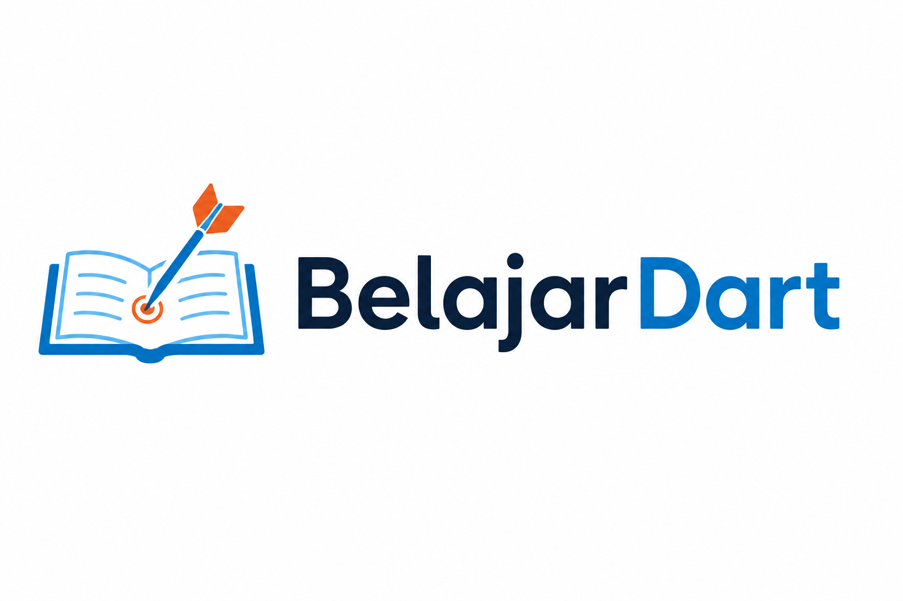

<p align="center">
  <a href="./README.md">English</a> | <a href="./README.id.md">Bahasa Indonesia</a>
</p>

<p align="center">
  
</p>

<p align="center">
  
</p>

<h1 align="center">Flutter Docs</h1>

<p align="center">
  Situs dokumentasi lengkap dan tutorial terstruktur untuk belajar Dart dan membangun aplikasi Flutter.
</p>

<p align="center">
  <a href="https://github.com/faisalaffan/belajardart/blob/dev/LICENSE"></a>
  
  
</p>

---

## Fitur

- **Dokumentasi Dart** — Panduan teknis dan referensi bahasa
- **Tutorial Flutter** — Tutorial terstruktur langkah demi langkah dengan best practice
- **Pencarian Teks Penuh** — Temukan topik dengan cepat menggunakan `Ctrl+K` / `Cmd+K`
- **UI Modern** — Ditenagai oleh [Fumadocs](https://fumadocs.vercel.app/) dengan tampilan baca yang bersih

## Memulai

### Prasyarat

- [Node.js](https://nodejs.org/) 18+
- [pnpm](https://pnpm.io/)

### Instalasi

```bash
# Clone repositori
git clone https://github.com/faisalaffan/belajardart.git
cd belajardart

# Install dependensi
pnpm install

# Jalankan server development
pnpm dev
```

Buka [http://localhost:3000](http://localhost:3000) di browser.

### Build untuk Produksi

```bash
pnpm build
pnpm start
```

## Struktur Proyek

```
belajardart/
├── app/              # Route aplikasi Next.js
├── assets/           # Gambar, banner, ikon
├── content/
│   ├── docs/         # Halaman dokumentasi (MDX)
│   └── tutorials/    # Halaman tutorial (MDX)
├── lib/              # Utilitas bersama
├── source.config.ts  # Konfigurasi sumber Fumadocs
└── next.config.mjs   # Konfigurasi Next.js
```

## Kontribusi

Kontribusi sangat diterima! Silakan buka issue atau kirim pull request untuk memperbaiki dokumentasi.

## Lisensi

Proyek ini dilisensikan di bawah [Creative Commons Attribution-ShareAlike 4.0 International](LICENSE).
